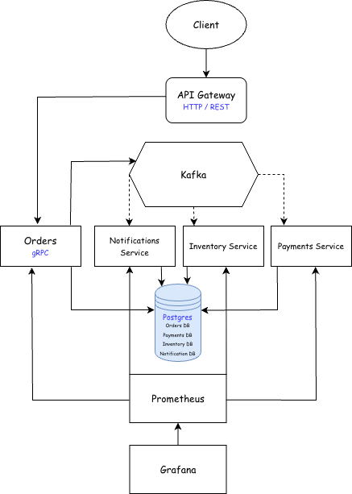

# Order Processing Platform
Система обработки заказов с gRPC-взаимодействием, событийной коммуникацией через Kafka, PostgreSQL и полноценным мониторингом в Prometheus + Grafana.

Проект демонстрирует:

- gRPC-взаимодействие между сервисами
- Асинхронные события через Kafka (Transactional Outbox, idempotent consumers)
- PostgreSQL: транзакции, индексы, логическое шардирование / partitioning
- Observability: метрики, алерты и дашборды в Grafana

**Доменные события в Kafka**
- OrderCreated: “заказ создан” (order_id, user_id, сумма, items, timestamp)
- PaymentSucceeded: “оплата прошла” (order_id, payment_id, сумма, timestamp)
- PaymentFailed: “оплата не прошла” (order_id, причина)
- InventoryReserved: “товар зарезервирован” (order_id, sku->qty)
- InventoryReservationFailed: “не смогли зарезервировать”
- OrderCompleted / OrderCanceled: “заказ завершён/отменён”

[Protobuf contracts](github.com/ChernykhITMO/order-processing-proto)

## Архитектура

