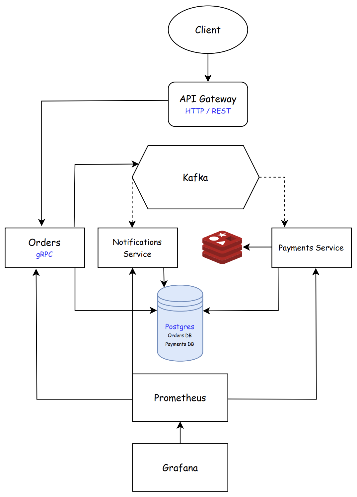

# Order Processing Platform

Учебный микросервисный проект на Go: gRPC‑сервис заказов, HTTP‑gateway, событийное взаимодействие через Kafka, хранение в PostgreSQL и Redis
## Что реализовано
- gRPC‑API для создания и получения заказа
- HTTP‑gateway, который проксирует REST → gRPC
- Событийный поток через Kafka:
  - `order-topic` — создание заказа
  - `status-topic` — результат оплаты
- Outbox‑паттерн для надёжной публикации событий (orders, payments)
- Идемпотентная обработка Kafka‑сообщений в payments (таблица `processed_events`)
- Redis‑хранилище уведомлений с TTL (настраивается через `REDIS_TTL`)

[Protobuf contracts](https://github.com/ChernykhITMO/order-processing-proto)

## Архитектура



## Сервисы

- **orders**  
  gRPC‑сервис. Хранит заказы и позиции в PostgreSQL. Пишет событие `OrderCreated` в outbox‑таблицу и отправляет его в Kafka по расписанию

- **payments**  
  Kafka‑consumer: принимает `OrderCreated`, создаёт/обновляет оплату в PostgreSQL, пишет событие `PaymentStatus` в outbox и публикует в Kafka

- **notifications**  
  Kafka‑consumer: принимает `PaymentStatus` и сохраняет уведомления в Redis с TTL

- **gateway**  
  HTTP‑сервер (REST → gRPC). Работает как внешний вход в систему. Подключается к `orders` по gRPC

## Технологии
- Go, gRPC
- PostgreSQL
- Kafka (+ Kafka UI)
- Redis
- Docker Compose

## Запуск локально (Docker)

1) Скопируйте шаблоны окружения:
```bash
cp .env.example .env
cp orders/.env.example orders/.env
cp payments/.env.example payments/.env
cp notifications/.env.example notifications/.env
```

2) Проверьте адреса сервисов в `.env`:
- Postgres: `postgres:5432`
- Kafka: `kafka_produce:29092`
- Redis: `redis:6379`

3) Поднимите инфраструктуру и сервисы:
```bash
docker compose -f docker-compose.yaml up -d --build
```

4) Создайте базы:
```bash
make db-create
```

5) Примените миграции (нужен установленный `migrate` CLI):
```bash
make migrate-up
```

Redis поднимается контейнером и не требует инициализации. TTL хранится в `notifications/.env` через `REDIS_TTL` (например `48h`).

## Примечания
- Порт gRPC сервиса orders задаётся в `orders/.env` (`ORDERS_GRPC_ADDR`). Он должен совпадать с портом, который пробрасывается в `docker-compose.yaml`.
